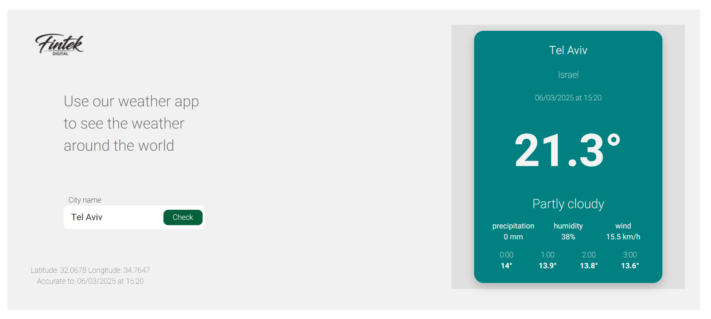

# Weather App

## Project Description
This project is a weather application built with React. It allows users to check the weather in different cities around the world. The app fetches weather data from an external API and displays it in a clear and user-friendly manner.

## Project Structure
The project includes the following directories and files:

```
weather/
├── public/
│   ├── images/
│   │   └── fintex.jpg
├── src/
│   ├── component/
│   │   ├── FetchWeather.js
│   │   └── FintaxImage.js
│   ├── pages/
│   │   └── Home.js
│   ├── service/
│   │   └── api.js
│   ├── styles/
│   │   ├── global.css
│   │   ├── layout.css
│   │   ├── search.css
│   │   ├── weatherCard.css
│   │   └── responsive.css
│   ├── App.css
│   ├── App.js
│   ├── index.js
│   └── .env
│   └── .env.example
├── .gitignore
├── package.json
├── README.md
```

## Installation
To run the project locally, follow these steps:

1. Clone the repository:
    ```bash
    git clone https://github.com/TAMAR-ZIL/weather.git
    ```

2. Install all dependencies:
    ```bash
    cd weather
    npm install
    ```

3. Create a `.env` file based on the example provided in `.env.example` and set the appropriate variables:
    ```plaintext
    WEATHER_API_KEY=your_api_key_here
    VITE_API_URL=https://api.weatherapi.com/v1/forecast.json
    ```

4. Start the application:
    ```bash
    npm start
    ```

## Usage
After starting the application, you can access it via your web browser at `http://localhost:3000`. The app will display an input field where you can enter the name of a city to check its weather.

## Features
- Real-time weather updates
- Search weather by city name
- Display temperature, precipitation, humidity, and wind speed
- Responsive design for mobile and desktop

## Technologies Used
- React
- Axios
- CSS

## Screenshots


## .gitignore
The `.gitignore` file includes all files and directories that should not be uploaded to the repository, including environment variable files (ENV) and the node_modules directory.

## Contribution
If you wish to contribute to the project, please open an issue or pull request in the repository.

## Contact
For any questions or suggestions, feel free to contact me:

- GitHub: [TAMAR-ZIL](https://github.com/TAMAR-ZIL/weather)
- Email: t0527199526@gmail.com

## License
This project is licensed under the MIT License. For more details, see the LICENSE file in the repository.
