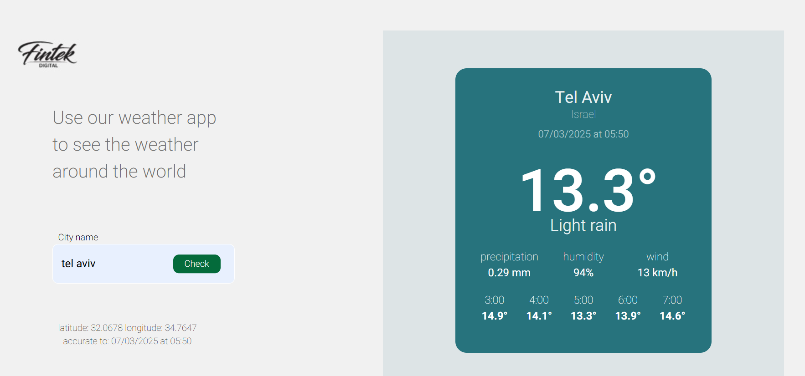

# Weather App 🌤️

A modern, responsive weather application that lets you check the weather for any city in the world. This app integrates with a weather API to provide real-time weather updates, displayed in a clean and user-friendly design.
## Screenshots


## Features

- **City Search**: Enter the name of any city to get up-to-date weather information.
- **Weather Data**: Displays temperature, humidity, wind speed, precipitation, and more.
- **Responsive Design**: Works seamlessly across devices — mobile, tablet, and desktop.
- **Live Updates**: Weather data is dynamically fetched from the server and updated in real-time.

## Tech Stack

- **Frontend**: React.js, Custom CSS
- **Backend**: Node.js, Express.js
- **Weather API**: [WeatherAPI](https://www.weatherapi.com/)
- **Styling**: Clean, custom-designed CSS with responsive design for all screen sizes.

## Getting Started

Follow these steps to get the project running locally:

### 1. Clone the Repository

```bash
git clone https://github.com/yourusername/weather-app.git
cd weather-app
2. Install Dependencies
First, install the server-side dependencies for the backend:

bash
Copy
Edit
cd backend
npm install
Then, go to the frontend directory and install the necessary dependencies for the client:

bash
Copy
Edit
cd ../frontend
npm install
3. Setup Environment Variables
Create a .env file in the backend directory by copying the .env.example file:

bash
Copy
Edit
cp .env.example .env
Then, open the .env file and add your WeatherAPI key:

bash
Copy
Edit
WEATHER_API_KEY=your_api_key_here
4. Run the App
To start the backend server:

bash
Copy
Edit
cd backend
npm start
To start the frontend:

bash
Copy
Edit
cd frontend
npm start
The app will be available at http://localhost:3000 in your browser.

Usage
Open the app in your browser.
Enter the name of the city you'd like to check the weather for in the search bar.
Click the "Check" button to fetch the weather information for that city.
The weather details will appear, including temperature, humidity, wind speed, and precipitation.
Screenshots
Here are some screenshots of the Weather App in action:


Contributing
We welcome contributions to the project! If you'd like to contribute:

Fork the repository.
Create a new branch.
Make your changes.
Submit a pull request.
Please ensure your code follows the existing style and write meaningful commit messages.

License
This project is open-source and available under the MIT License.

Contact
For any questions or feedback, feel free to reach out:

Email: t0527199526@gmail.com
GitHub: https://github.com/TAMAR-ZIL/weather
Thank you for checking out the Weather App! 🌦️


 
